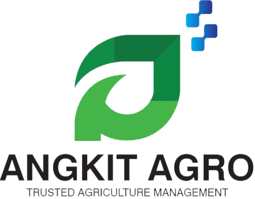

# angkit_customer

Angkit agro QR customer application (scanner)

## How to modify the code?

This project is using riverpod as its state management solution.

Please read this before before modifying the code to avoid structural changes

- 
- [Cookbook: Useful Flutter samples](https://docs.flutter.dev/cookbook)

For help getting started with Flutter development, view the
[online documentation](https://docs.flutter.dev/), which offers tutorials,
samples, guidance on mobile development, and a full API reference.
